# Virtual PLC (vPLC)

<p align="center">
  
</p>

<p align="center">
  <strong>Production-grade soft PLC runtime in Rust, targeting real-time industrial control with WebAssembly-sandboxed logic execution.</strong>
</p>

<p align="center">
  
  
  
  
  
</p>

---

## ⚠️ Safety Warning

> [!CAUTION]
> **IMPORTANT:** This software is provided for educational and development purposes. Industrial control systems require extensive validation, certification, and safety measures beyond what is provided here.
>
> - This software has **NOT** been certified for safety-critical applications (IEC 61508, ISO 13849)
> - Do **NOT** use in life-safety, motion control, or critical infrastructure without proper validation
> - Always implement hardware safety interlocks independent of software control
> - Consult qualified automation engineers for production deployments

---

## ✨ Features

| Feature | Description |
|---------|-------------|
| 🔧 **IEC 61131-3 Compiler** | Full Structured Text compiler targeting WebAssembly |
| ⚡ **Sub-ms Cycle Times** | Deterministic execution with PREEMPT_RT support |
| 🧊 **Wasm Sandboxing** | Fault-isolated logic execution via Wasmtime |
| 🔌 **Industrial Fieldbuses** | EtherCAT with DC sync, Modbus TCP, simulated I/O |
| 📊 **Built-in Metrics** | Per-phase cycle timing, Prometheus-compatible histograms |
| 🛡️ **Production Hardened** | Watchdog, safe outputs, fault recording, configurable fault policies |
| 🔄 **Split-Plane Architecture** | Decoupled fieldbus I/O from logic execution |
| 📚 **Standard Library** | Timers, counters, triggers, flip-flops (TON, CTU, R_TRIG, SR...) |
| ⚙️ **Resource Limits** | Enforced Wasm memory/table limits, optional fuel-based WCET budgeting |
| 🔒 **Deterministic Mode** | Optional strict Wasm feature set for reproducible execution |

---

## 📊 Project Status

| Component | Status | Description |
|-----------|--------|-------------|
| `plc-compiler` | ✅ Functional | ST → AST → IR → Wasm pipeline complete |
| `plc-runtime` | ✅ Functional | Cyclic scheduler, Wasm host, process image, metrics |
| `plc-stdlib` | ✅ Complete | All standard function blocks implemented |
| `plc-fieldbus` | 🔶 Partial | Simulated driver complete, EtherCAT/Modbus scaffolded |
| `plc-daemon` | ✅ Functional | Binary entry point with signal handling |
| `plc-common` | ✅ Complete | Shared types, configuration, error handling |
| `plc-web-ui` | 🔴 Scaffold | Control plane UI placeholder |

---

## 🏗️ Architecture

vPLC implements a **split-plane architecture** that decouples fieldbus I/O from logic execution:

- **Fieldbus Plane**: Handles real-time communication with industrial devices (EtherCAT, Modbus TCP, simulated I/O)
- **Logic Plane**: Executes IEC 61131-3 Structured Text programs compiled to WebAssembly

This separation provides fault isolation, deterministic timing, and the ability to hot-reload logic without disrupting I/O communication.

<p align="center">
  
</p>

### System Overview

```mermaid
flowchart TB
    subgraph Daemon["🚀 plc-daemon"]
        direction TB
        Signal["Signal Handling"]
        Config["Configuration"]
    end
    
    subgraph Runtime["⚡ plc-runtime"]
        Scheduler["Cyclic Scheduler"]
        WasmHost["Wasmtime Host"]
        IOImage["Process Image"]
        Watchdog["Watchdog"]
    end
    
    subgraph Compiler["🔧 plc-compiler"]
        Parser["ST Parser"]
        TypeCheck["Type Checker"]
        IR["IR Generator"]
        Codegen["Wasm Codegen"]
    end
    
    subgraph Fieldbus["🔌 plc-fieldbus"]
        EtherCAT["EtherCAT Master"]
        Modbus["Modbus TCP"]
        Simulated["Simulated I/O"]
    end
    
    subgraph Stdlib["📚 plc-stdlib"]
        Timers["Timers"]
        Counters["Counters"]
        Triggers["Triggers"]
    end

    Daemon --> Runtime
    Compiler --> WasmHost
    Stdlib --> Compiler
    Runtime --> Fieldbus
```



### Compiler Pipeline

<p align="center">
  
</p>

### Scan Cycle

```mermaid
sequenceDiagram
    participant S as ⏱️ Scheduler
    participant F as 🔌 Fieldbus
    participant W as 🧊 Wasm Logic
    participant M as 📊 Metrics
    
    loop Every Cycle (1ms default)
        S->>F: exchange()
        F-->>S: inputs
        S->>W: step(inputs)
        W-->>S: outputs
        S->>F: set_outputs()
        S->>M: record_cycle()
    end
```



### Crate Dependencies

| Crate | Description |
|-------|-------------|
| `plc-daemon` | Binary entry point with signal handling and diagnostics |
| `plc-runtime` | Cyclic scheduler, Wasm host (Wasmtime), process image |
| `plc-compiler` | IEC 61131-3 Structured Text → WebAssembly compiler |
| `plc-fieldbus` | Fieldbus abstraction (EtherCAT, Modbus TCP, simulated) |
| `plc-stdlib` | Standard function blocks (timers, counters, triggers) |
| `plc-common` | Shared IEC types, configuration, error handling |
| `plc-web-ui` | Control plane web interface (scaffold) |

---

## 🚀 Quick Start

### Build

```bash
# Build all crates
cargo build --release

# Run tests
cargo test -q
```

### Run with Simulated I/O

```bash
# Start daemon with simulated fieldbus
cargo run -p plc-daemon -- --simulated

# With a compiled Wasm module
cargo run -p plc-daemon -- --simulated -w programs/blink.wasm
```

### Compile ST to Wasm

```rust
use plc_compiler::compile;

let source = r#"
    PROGRAM Main
    VAR
        counter : INT := 0;
    END_VAR
        counter := counter + 1;
    END_PROGRAM
"#;

let wasm_bytes = compile(source).expect("Compilation failed");
```

---

## ⚙️ Configuration

### CLI Flags

| Flag | Description |
|------|-------------|
| `-c, --config <FILE>` | Path to TOML configuration file |
| `-w, --wasm-module <FILE>` | Path to Wasm logic module |
| `-s, --simulated` | Use simulated fieldbus (no hardware) |
| `--max-cycles <N>` | Maximum cycles to run (0 = infinite) |
| `-l, --log-level <LEVEL>` | Log level (trace, debug, info, warn, error) |

### TOML Configuration

```toml
# Scan cycle time
cycle_time = "1ms"
watchdog_timeout = "3ms"
max_overrun = "500us"

# Wasm logic module
wasm_module = "programs/main.wasm"

[realtime]
enabled = true
policy = "fifo"           # fifo, rr, or other
priority = 90             # 1-99 for RT policies
cpu_affinity = 2          # Pin to CPU core 2
lock_memory = true
prefault_stack_size = 8388608

[fieldbus]
driver = "ethercat"       # simulated, ethercat, modbus_tcp

[fieldbus.ethercat]
interface = "eth0"
dc_enabled = true
dc_sync0_cycle = "1ms"

[metrics]
enabled = true
histogram_size = 10000
percentiles = [50.0, 90.0, 99.0, 99.9]
http_export = false
http_port = 9090
```

See [`config/default.toml`](config/default.toml) for a fully documented example.

---

## 📐 IEC 61131-3 Support

### Data Types

| Type | Rust Equivalent | Description |
|------|-----------------|-------------|
| `BOOL` | `bool` | Boolean |
| `SINT`, `INT`, `DINT`, `LINT` | `i8`, `i16`, `i32`, `i64` | Signed integers |
| `USINT`, `UINT`, `UDINT`, `ULINT` | `u8`, `u16`, `u32`, `u64` | Unsigned integers |
| `REAL`, `LREAL` | `f32`, `f64` | Floating point |
| `BYTE`, `WORD`, `DWORD`, `LWORD` | `u8`, `u16`, `u32`, `u64` | Bit strings |
| `TIME` | `i64` (nanoseconds) | Duration |
| `STRING`, `WSTRING` | String | Character strings |
| `ARRAY[l..u] OF T` | Array | Arrays with bounds |

### Program Units

- `PROGRAM` - Main program unit
- `FUNCTION_BLOCK` - Reusable stateful blocks
- `FUNCTION` - Stateless functions with return values

### Control Flow

- `IF ... THEN ... ELSIF ... ELSE ... END_IF`
- `CASE ... OF ... ELSE ... END_CASE`
- `FOR ... TO ... BY ... DO ... END_FOR`
- `WHILE ... DO ... END_WHILE`
- `REPEAT ... UNTIL ... END_REPEAT`
- `EXIT`, `CONTINUE`, `RETURN`

### Standard Function Blocks (plc-stdlib)

| Block | Description |
|-------|-------------|
| `TON` | Timer On-Delay |
| `TOF` | Timer Off-Delay |
| `TP` | Timer Pulse |
| `CTU` | Counter Up |
| `CTD` | Counter Down |
| `CTUD` | Counter Up/Down |
| `R_TRIG` | Rising Edge Trigger |
| `F_TRIG` | Falling Edge Trigger |
| `SR` | Set-Reset Flip-Flop (set dominant) |
| `RS` | Reset-Set Flip-Flop (reset dominant) |

---

## 🔧 Real-Time Deployment

### Requirements

For deterministic real-time execution:

1. **PREEMPT_RT Kernel**: Linux kernel with `PREEMPT_RT` patches
2. **CPU Isolation**: Dedicate CPU cores to PLC tasks via `isolcpus`
3. **Privileges**: `CAP_SYS_NICE`, `CAP_IPC_LOCK`, `CAP_NET_RAW`

### Docker Deployment

```yaml
# docker-compose.yml
services:
  plc:
    build: .
    privileged: true
    cap_add:
      - SYS_NICE
      - IPC_LOCK
      - NET_RAW
    ulimits:
      rtprio: 99
      memlock: -1
    network_mode: host
```

```bash
docker compose build
docker compose up
```

### Host Tuning

See [`scripts/host_tune.md`](scripts/host_tune.md) for kernel parameter tuning.

### Latency Verification

```bash
./scripts/verify_latency.sh
```

Uses `cyclictest` to measure scheduling latency. Target: < 50µs worst-case.

---

## 🧩 Wasm Host API

Wasm modules import functions from the `"plc"` module:

| Function | Signature | Description |
|----------|-----------|-------------|
| `read_di` | `(i32) -> i32` | Read digital input bit |
| `write_do` | `(i32, i32) -> ()` | Write digital output bit |
| `read_ai` | `(i32) -> i32` | Read analog input channel |
| `write_ao` | `(i32, i32) -> ()` | Write analog output channel |
| `get_cycle_time` | `() -> i32` | Get cycle time in nanoseconds |
| `get_cycle_count` | `() -> i64` | Get current cycle number |
| `is_first_cycle` | `() -> i32` | Check if first cycle after init |
| `log_message` | `(i32, i32) -> ()` | Log message (ptr, len) |

### Module Requirements

Wasm modules must export:
- `memory` - Linear memory
- `step()` - Called every scan cycle

Optional exports:
- `init()` - Called once before first cycle
- `fault()` - Called when entering fault mode

---

## 🔑 Key Abstractions

### LogicEngine Trait

```rust
pub trait LogicEngine: Send {
    fn init(&mut self) -> PlcResult<()>;
    fn step(&mut self, inputs: &ProcessData) -> PlcResult<ProcessData>;
    fn fault(&mut self) -> PlcResult<()>;
    fn is_ready(&self) -> bool;
}
```

Implementations: `WasmtimeHost`, `NullEngine`

### FieldbusDriver Trait

```rust
pub trait FieldbusDriver: Send {
    fn init(&mut self) -> PlcResult<()>;
    fn read_inputs(&mut self) -> PlcResult<()>;
    fn write_outputs(&mut self) -> PlcResult<()>;
    fn exchange(&mut self) -> PlcResult<()>;
    fn shutdown(&mut self) -> PlcResult<()>;
}
```

Implementations: `SimulatedDriver`, `EtherCatDriver` (scaffold)

---

## 🗺️ Roadmap

- [x] IEC 61131-3 Structured Text compiler to Wasm
- [x] Real-time cyclic scheduler with PREEMPT_RT support
- [x] Standard function blocks (timers, counters, triggers, bistables)
- [x] Simulated fieldbus driver for testing
- [x] Process image abstraction
- [x] Watchdog and fault handling
- [x] Cycle metrics and histograms
- [ ] EtherCAT master integration (SOEM-based)
- [ ] Modbus TCP driver
- [ ] Web-based control plane UI
- [ ] Hot-reload of logic modules
- [ ] Ladder Diagram (LD) support
- [ ] Function Block Diagram (FBD) support
- [ ] OPC UA server integration

---

## 🤝 Contributing

Contributions are welcome! Here's how you can help:

1. **Report bugs** - Open an issue describing the problem
2. **Suggest features** - Open an issue with your idea
3. **Submit PRs** - Fork, make changes, and submit a pull request

### Development Setup

```bash
# Clone the repository
git clone https://github.com/your-org/virtual-plc.git
cd virtual-plc

# Build and test
cargo build
cargo test

# Run with simulated I/O
cargo run -p plc-daemon -- --simulated
```

### Code Style

- Follow Rust idioms and conventions
- Run `cargo clippy` before submitting PRs
- Ensure all tests pass with `cargo test`

---

## 📚 Documentation

- [`docs/process-image-abi.md`](docs/process-image-abi.md) - Wasm memory layout contract
- [`docs/acceptance-criteria.md`](docs/acceptance-criteria.md) - Production acceptance criteria
- [`docs/adr/001-runtime-arch.md`](docs/adr/001-runtime-arch.md) - Runtime architecture decisions
- [`scripts/host_tune.md`](scripts/host_tune.md) - Host tuning guide

---

## 📜 License

This project is dual-licensed under:

- [MIT License](LICENSE-MIT)
- [Apache License 2.0](LICENSE-APACHE)

Choose whichever license works best for your use case.
